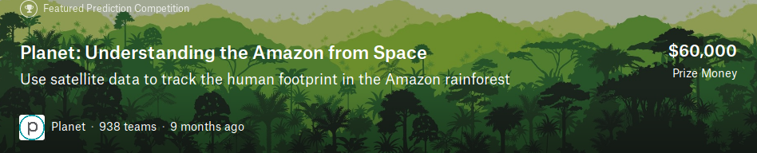
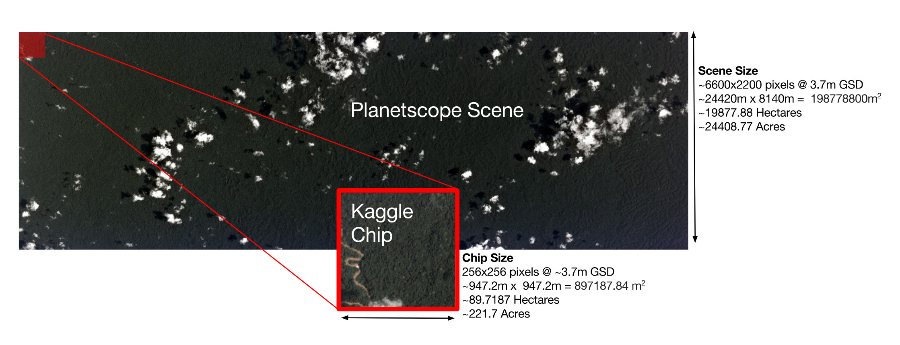
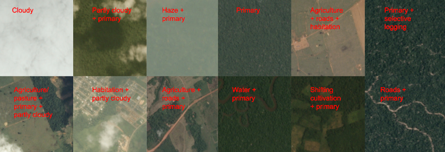
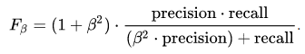
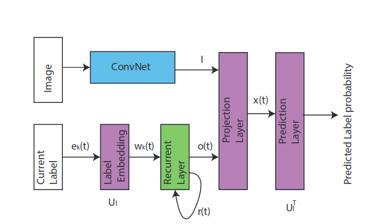
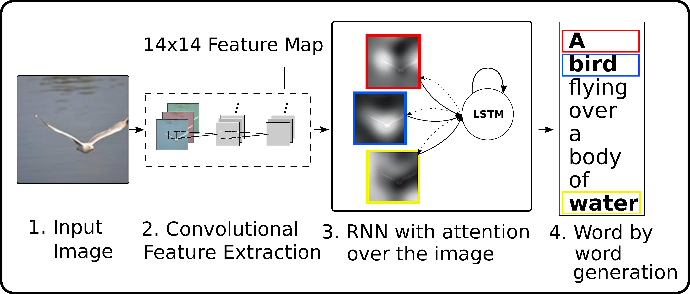
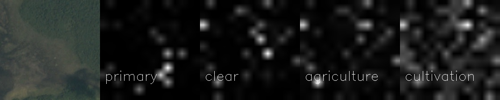
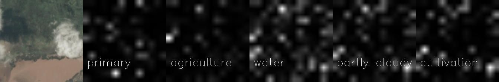
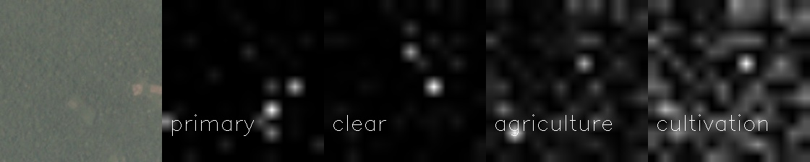

# Amazon Stelite Image Labeling

Our task was to solve the problem in [Planet: Understanding the Amazon from Space](https://www.kaggle.com/c/planet-understanding-the-amazon-from-space) .
The contest have a large dataset of satellite images collected over the Amazon Rain-forest with multiple labels for each such 256x256
blocks. There were total 17 type of classes possible for a particular image block. Our task is to given an image predict multiple labels
possible for an image. The dataset avaiable as RGB images and Infrared Images. Here due to resource constrains we only use the RGB images for our experiment.

| Possible Labels| 
| ------------- |
|primary |
|clear |
|agriculture |
|road |
|water |
|partly_cloudy |
|habitation |
|cultivation |
|haze |
|cloudy |
|bare_ground |
|blooming |
|slash_burn |
|artisinal_mine |
|selective_logging |
|blow_down |
|conventional_mine |

## Evaluation
The evaluation is done by F2 Score , where beta=2 in the following formula.

## Approaches 
We breifly followed three different networks all of them a combination of CNN and RNN. 
### CNN-RNN: A Unified Framework for Multi-label Image Classification
Here we basically use the network proposed by Wang et al. the network involves a CNN to extract features from the image and a RNN that predicts the actual labels. Here the CNN features are summed with the hidden state at time step and the combined CNN(Image) and Hidden State at time step t to predict the label yt at time step t. 

### Show and Tell Image Captioning
Here we use an Image Captioning Network proposed by Vinyals et al. instead of LSTM we used GRUs for our experiment and we used a pretrained Resnet18 for our experiments. Also instead of initializing the decoder with the CNN(image) we concat the CNN(image) features with every time steps input. 

### Show Attend & Tell 
Finaly we extend the show and tell and apply spatial attention here we tak the 3rd last conv layer output of the resnet network where our CNN feature size is [n_batch,512,14,14] and our hidden state size of the GRU is 512 and we apply attention over all the 14x14 blocks of 512 dimensional blocks and get our context vector for each time step. 

## Dependencies

	python3.5
	cv2
	pytorch=0.3.1
	torchvision
	pandas
	numpy

## Running Instruction

### Dataset
The dataset is available in the contest page to download. We split the dataset into train and val split as there were to validation data available. the directory structure of our dataset folder is like

	dataset/
		train/
			images/
			labels.csv
		val/
			images/
			labels.csv
		test/
			images/
		labels.txt

### Config File 

	{
		"paths":{
			"cnn_save_path"		: "save_models/cnn_rnn_attn/best_cnn_model.model",
			"rnn_save_path" 	: "save_models/cnn_rnn_attn/best_rnn_model.model",
			"save_loss_path"	: "save_models/cnn_rnn_attn/loss.csv",
			"label_list_file"	: "dataset/labels.txt",
			"train_dir"			: "dataset/train/images/",
			"train_labels_file"	: "dataset/train/labels.csv",
			"val_dir"			: "dataset/val/images/",
			"val_labels_file"	: "dataset/val/labels.csv",
			"test_dir"			: "dataset/test/images",
			"submission_file"	: "submission.csv"
		},
		"model":{
			"embed_size"		: 128,
			"hidden_size"		: 512,
			"total_size"		: 64
		},
		"training":{
			"n_epoch_1"			: 15,
			"n_epoch_2"			: 20,
			"lr_1"				: 1e-3,
			"lr_2"				: 1e-4,
			"lr_1_decay"		: 1.6,
			"lr_2_decay"		: 1.4,
			"load_intial"		: false,
			"batch_size"		: 32,
			"n_workers"			: 4,
			"use_gpu"			: true,
			"cuda_device"		: 0,
			"n_batch_print"		: 50,
			"attention"			: true,
			"draw_image"		: false
		}
	}
	
	
### Training Model

	python3 train.py config.json

### Predicting and Generate submission.csv
	
	python3 predict.py config.json
	
## Results

All our models use GRU and the last attention one uses VGG16 pretrained others use RestNet18. The attention model took 6hrs to train on one GTX 1080. 

| Model | Validation | Test |
|--| -- |--|
|CNN-RNN | 88.6 | 88.34 |
|CNN-RNN with CNN fine tuning | 89.81 | 89.61 |
|CNN-RNN Caption | 89.81 | 89.76 |
|CNN-RNN Attention | 90.36 | 90.25 |
|CNN-RNN with CNN pretraining | 90.10 | 89.51 |

**Current Best in Kaggle Leaderboard 93.32**

### Attention Visualization

 

## To Do

-	Fix Attention

## References

- [CNN-RNN: A Unified Framework for Multi-label Image Classification](https://arxiv.org/abs/1604.04573)
- [Show and Tell: A Neural Image Caption Generator](https://arxiv.org/abs/1411.4555)
- [Show, Attend and Tell: Neural Image Caption Generation with Visual Attention](https://arxiv.org/abs/1502.03044)
- [A CNN-RNN Architecture for Multilabel Classification of the Amazon](cs231n.stanford.edu/reports/2017/posters/903.pdf)
 